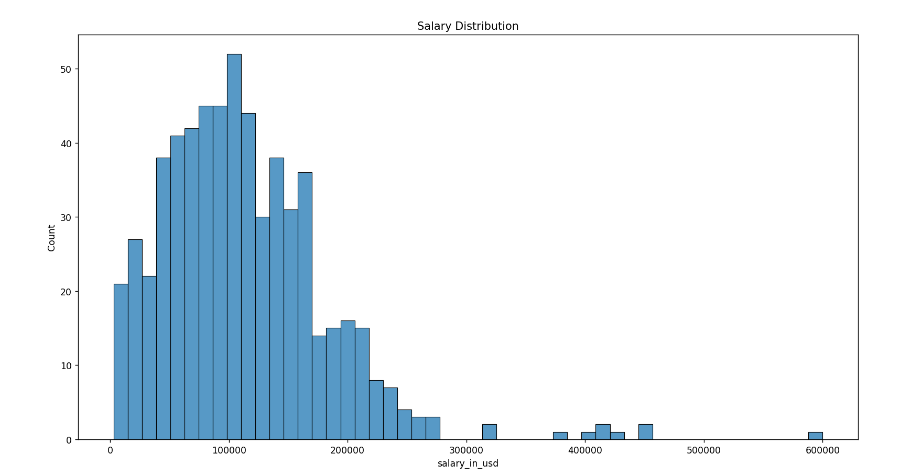
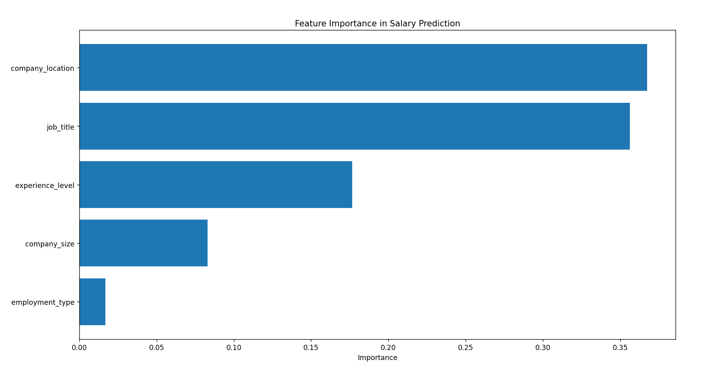
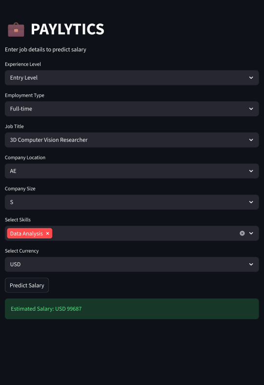

# 💰 Paylytics
### AI-Powered Salary Prediction App

Paylytics is a Machine Learning web application that predicts salaries based on job attributes such as experience level, employment type, job title, company location, and company size.

The application is built using **Python, Scikit-learn, and Streamlit**, providing an interactive interface for users to estimate salaries based on real-world job data.

---

## 🌐 Live Demo

Try the app here:

https://anveshasrivastava41-ship-it-paylytics.streamlit.app/

---

## ✨ Features

- Predict salary using **Machine Learning**
- Built with **Random Forest Regression**
- Interactive **Streamlit UI**
- Job-based predictions using real salary datasets
- Skill selection for better context
- Simple and user-friendly interface

---

## 🛠 Tech Stack

**Frontend**
- Streamlit

**Backend**
- Python

**Machine Learning**
- Scikit-learn
- Pandas
- NumPy

**Visualization**
- Matplotlib
- Seaborn

---

## 📊 Exploratory Data Analysis

### Salary Distribution



This graph shows how salaries are distributed across different data science roles.

---

### Feature Importance



This visualization shows which features have the most impact on salary prediction.

Key insights:

- Experience level strongly influences salary
- Job title and company size also play significant roles
- Location contributes to salary variation

---

## 🖥 Streamlit Web Application



Users can input job details and the model predicts the estimated salary.

---

## ⚙️ Installation

Clone the repository:

```bash
git clone https://github.com/anveshasrivastava41-ship-it/ML-Salary-Prediction.git
```

Navigate to the project folder:

```bash
cd ML-Salary-Prediction
```

Install dependencies:

```bash
pip install -r requirements.txt
```

Run the Streamlit application:

```bash
streamlit run streamlit_app.py
```
## 📁 Project Structure
ML-Salary-Prediction
│
├── eda.py
├── train_model.py
├── streamlit_app.py
├── model.pkl
├── salaries.csv
├── requirements.txt
│
├── feature_importance.png
├── salary_distribution.png
├── streamlit_app

---


---

## 🚀 Future Improvements

- Add salary analytics dashboard
- Add more job role predictions
- Integrate real-time job market data
- Improve model accuracy

---

## 👩‍💻 Author

**Anvesha Srivastava**

GitHub:  
https://github.com/anveshasrivastava41-ship-it

